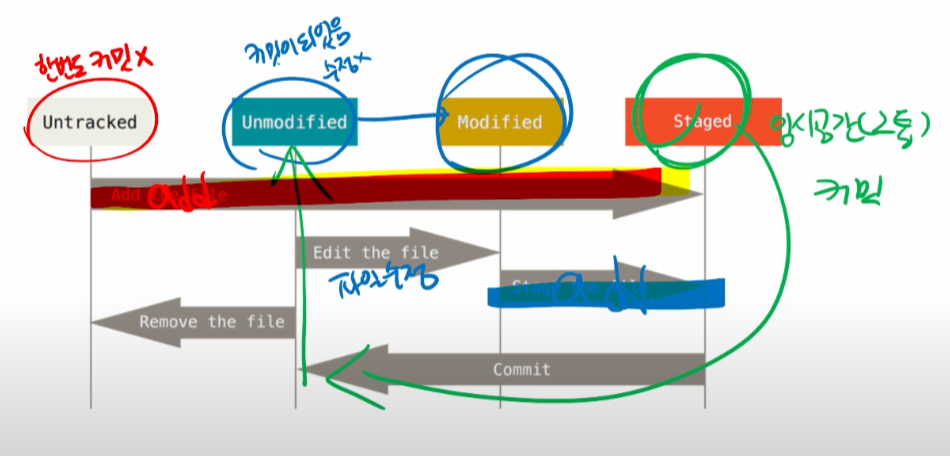

# Github




GIT (분산버전관리시스템)의 버전 생성 과정

커밋은 의미있는 저장이고 커밋된 스프트웨어는 반드시 작동가능한 상태여야 한다.

빈 폴더는 git status 해도 나타나지 않는다.

ctrl + C 는 탈출 명령어


**깃 허브**

원격저장소를 만들고, 로컬저장소의 커밋을 '**push**' 한다.

원격저장소 정보 확인 : git remote -v

원격저장소 지정 : git remote add origin **url**

원격저장소로 전송 : git push origin master


## **clone 시 주의할 점**

1. 클론하면 원격 저장소이름의 폴더가 생성됨

``` git bash
 git clone URL
```

` * 깃 저장소 안에 다른 깃저장소를 생성하지 말기`


## **압축파일 저장과 클론의 차이점**

- 압축버전(zip)은 최신버전의 파일만 가져옴
- 클론은 버전(.git)까지 모두 가져옴


## **pull 과 clone 의 차이점**

- pull은 새롭게 커밋된 파일만 가져옴
- 하지만 클론은 모든 버전을 가져옴

```git bash
git pull origin master
```


# .gitkeep 과 .gitignore

.gitkeep : 빈 폴더를 만들기 위해 사용

.gitignore : git이 추적하지 않는 파일 관리 `폴더명은 바꿀 수 없다`

`.gitkeep 은 폴더명을 바꿔도 상관없지만 관용적인 표현이므로 origin, master, main 과 같이 바꾸지 않는 것이 좋다.`


### 브랜치 관련 명령어

***git branch***

: branch **검색**


***git branch 브랜치이름***

: branch **생성**


***git checkout 브랜치이름***

: 해당 branch로 **이동**


***git checkout -b 브랜치이름***

: 브랜치 **생성하면서 이동**


***git merge 브랜치이름***

: 현재 있는 브랜치에 입력한 브랜치를 **병합**시킴

`각각 다른 파일을 가지고 있는 브랜치를 병합하면 모두 합쳐지면서 새로운 브랜치가 병합되었다는 커밋이 발생한다. `

`같은 파일을 수정하여 각자 다른 파일로 만든 후 병합하면 충돌(conflict)이 발생하고 직접 수정하라는 페이지가 생성된다. 직접 편집 후에 커밋해주면 정상적으로 병합된다.`


***git branch -d 브랜치이름***

: 해당 브랜치 **삭제**

`브랜치 병합 후 삭제해도 master브랜치에 있는 파일은 삭제되지 않는다. `

`그러므로 병합 후 무조건 삭제하는 편이 좋다.`


## 깃 헙을 통한 협업 과정 요약


1. 원하는 저장소 포크(fork)
2. 포크된 저장소 클론url 따오기 (나의 Repository)
3. 내 로컬 저장소에 클론 생성
4. 브랜치 생성
5. 수정 작업
6. 커밋 후 푸쉬(생성된 브랜치로)
7. pull request 진행