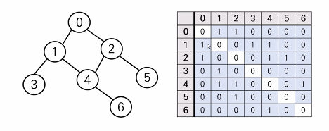

# 시간 복잡도 & 빅오 표기법

좋은 알고리즘이란 무엇일까?

== 효율성이 좋은 알고리즘?

== 성능이 좋은 알고리즘?

== Input을 넣은 후 Output이 나오는 시간이 짧은 알고리즘!

객관적인 측정을 위해 알고리즘 내부에서 기본연산이 몇 번 일어나는지 살펴본다.

1 < logN < N < NlogN < N^2 < N^3 < 2^N < N!

시간 복잡도가 O(1)인 함수들(활용하면 좋다!)

len()

pop()

append()

set()

O(N)인 함수들(사용해도 된다)

count()

index()

reverse()s

O(N^2) (조금 부담스럽지만 사용해도 된다.)

sort()

.find() 와 .index() 의 차이점

- index는 위치를 찾지 못하면 에러를 반환하지만 find는 -1를 반환.

# 스택, 큐(Stack, Queue)

**스택**

stack은 쌓는다는 의미로 가장 마지막에 들어온 데이터가 가장 먼저 나가므로 LIFO(후입선출) 방식

push 

스택에 새로운 데이터를 삽입하는 행위. 파이썬에서는 리스트를 append로 간단하게 구현할 수 있다.

pop

스택의 가장 마지막 데이터를 가져오는 행위. 파이썬에서는 리스트에 pop으로 간단하게 구현할 수 있다.

.pop() 메서드는 마지막 데이터를 삭제한다.

왜 스택을 써야할까?

1. 뒤집기, 되돌리기, 되돌아가기 (브라우저, 방문기록, 워드 ctrl + z)
2. 마무리 되지 않은 일을 임시 저장

- 괄호 매칭: vs코드에서 괄호를 스택을 활용하여 자동으로 매칭해주는 방식

- 함수 호출(재귀 호출)

- 백트래킹

- DFS(깊이 우선 탐색)

**큐**

큐는 한쪽 끝에서 데이터를 넣고, 다른 한 쪽에서만 데이터를 뺼수 있는 자료구조

가장 먼저 들어온 데이터가 가장 먼저 나가므로 FIFO(선입선출) 방식

dequeue

큐의 첫번째 데이터를 가져오는 행위. append()를 활용

enqueue

큐에 마지막에 새로운 데이터를 삽입하는 행위. popleft()를 활용한다.

파이썬에서 큐를 사용하려면 덱(Deque)을 사용하는 것이 좋다.

~~~python
from collections import deque
numbers = [1, 2, 3, 4, 5]
queue = deque(numbers)
queue.append(6)
queue.popleft()
print(queue)
# deque([2, 3, 4, 5, 6])
~~~

# 힙(Heap)

우선순위 큐는 우선순위를 기준으로 가장 우선순위가 높은 데이터가 가장 먼저 나가는 방식

우선순위 큐를 구현하는 방법

1. 배열
2. 연결 리스트
3. 힙

**힙의 특징**

- 최대값 또는 최소값을 빠르게 찾아내도록 만들어진 데이터구조

- 완전 이진 트리의 형태로 느슨한 정렬 상태를 지속적으로 유지한다.

- 힙 트리에서는 중복값을 허용한다.

힙은 언제 사용해야할까?

1. 데이터가 지속적으로 정렬되야 하는 경우 (느슨한 정렬)
2. 데이터에 삽입/삭제가 빈번할 때

파이썬의 heapq 모듈

Minheap(최소 힙)으로 구현되어 있음(가장 작은 값이 먼저 옴) Maxheap도 가능(가장 큰 값이 먼저 옴)

삽입, 삭제, 수정, 조회 연산의 속도가 리스트보다 빠르다.

heapq.heappop()

heapq.heappush()

~~~python
import heapq # 힙 구현

numbers = [5, 3, 2, 4, 1]
heapq.heapify(numbers) # numbers 자체가 바뀌어 버린다. 최솟값을 맨 앞으로 느슨한 정렬
print(numbers)
# [1, 3, 2, 4, 5]

heapq.heappop(numbers) # 첫번째 값을 뽑아내고 또 다시 가장 작은 값을 첫번째로 이동
print(numbers)
# [2, 3, 4, 5]

heapq.heappop(numbers)
print(numbers)
# [3, 4, 5]

heapq.heappush(numbers, 10)
print(numbers)
# [3, 5, 6, 10]

heapq.heappush(numbers, 0) # 가장 최솟값을 넣는 순간 정렬하여 맨앞으로 이동한다.
print(numbers)
# [0, 3, 5, 6, 10]

heapq.heappush(numbers, [-1, 1]) # 리스트도 넣을 수 있다.
print(numbers)
# [[-1, 1], 0, 3, 5, 6, 10] # 리스트 내 가장 작은 수를 비교하여 배치한다.
~~~

# 이차원 리스트

이차원 리스트는 리스트를 원소로 가지는 리스트일 뿐이다.

**✔tip** 

~~~python
print([0] * 2) # 리스트의 곱 연산이 가능한 파이썬!
# [0, 0]
~~~

**특정 값으로 초기화 된 이차원 리스트 만들기**

~~~python
n = 4	# 행
m = 3	# 열
matrix = []
for _ in range(n):
    matrix.append([0] * m)
   
print(matrix)
# [[0, 0, 0], [0, 0, 0], [0, 0, 0], [0, 0, 0]]
~~~

~~~python
n = 5
m = 5
matrix1 = [[0] * m for _ range(n)]
matrix2 = [[0] * m ] * n
# matrix1 과 2는 같은 결과 값을 보여준다.
# 하지만 같은 방식으로 만들어졌을까? X
# 1은 각 원소리스트들의 주소값이 전부 다르지만
# 2는 주소값이 전부 같다. 사용법이 다르겠지만 matrix2의 방식은 잘 쓰이지 않는다.
~~~

행렬의 크기가 미리 주어지는 경우

~~~python
# 3 * 3 크기의 입력을 받아보자.
# 1 2 3
# 4 5 6
# 7 8 9
matrix = []
for _ in range(3):
    line = list(map(int, input().split()))
    matrix.append(line)
# n * m 크기의 입력을 list comprehension 으로 작성하기
n, m = map(int, input().split())
matrix = [list(map(int, input().split())) for _ in range(n)]
print(matrix)
~~~

### 순회

이중 for문을 이용한 행 우선 순회

~~~python
matrix = [
    [1, 2, 3, 4],
    [5, 6, 7, 8],
    [9, 0, 1, 2]
]

for i in range(3):
    for j in range(4):
        print(matrix[i][j], end = ' ')
    print()
# 1 2 3 4
# 5 6 7 8
# 9 0 1 2
~~~

 

이중 for 문을 이용한 열 우선 순회

~~~python
matrix = [
    [1, 2, 3, 4],
    [5, 6, 7, 8],
    [9, 0, 1, 2]
]

for i in range(4):
    for j in range(3):
        print(matrix[j][i], end = ' ')
    print()
# 1 5 9
# 2 6 0
# 3 7 1
# 4 8 2
~~~

### 전치

전치란 행렬의 행과 열을 서로 맞바꾸는 것을 의미한다. 위의 방법들을 사용하면 된다.

### 회전

1. 왼쪽으로 90도 회전하기

~~~python
matrix = [
    [1, 2, 3],
    [4, 5, 6],
    [7, 8, 9]
]
n = 3
rotated_matrix = [[0] * n for _ in range(n)]

for i in range(n):
    for j in range(n):
        rotated_matrix[i][j] = matrix[j][n - i - 1]
~~~

2. 오른쪽으로 90도 회전하기

~~~python
matrix = [
    [1, 2, 3],
    [4, 5, 6],
    [7, 8, 9]
]
n = 3
rotated_matrix = [[0] * n for _ in range(n)]

for i in range(n):
    for j in range(n):
        rotated_matrix[i][j] = matrix[n - j - 1][i]
~~~

# 완전탐색 1

1. **무식하게 풀기(Brute-force)**

   - 브루트 포스는 모든 경우의 수를 탐색하여 문제를 해결하는 방식이다.

   -  가장 단순한 풀이 기법이며, 단순 조건문과 반복문을 이용해서 풀 수 있다.
   - 복잡한 알고리즘 보다는, 아이디어를 어떻게 코드로 구현할 것인지가 중요하다. 

   

2.  **델타 탐색**

~~~python
# 1. 델타값 정의
dy = [0, 0, 1, -1]
dx = [1, -1, 0, 0]
x, y = 1, 1

# 2. 이차원 리스트 순회
for x in range(n):
    for y in range(m):
        
        # 3. 델타값을 이용해 상하좌우 이동
		for d in range(4):
  		  	ny = y + dy[d]
  		  	nx = x + dx[d]
   			            
            # 4. 범위를 벗어나지 않으면 갱신
            if 0 <= nx < n and 0 <= ny < m: # 양방향 부등호 조건이 허용되는 언어는 파이썬 밖에 없다!! 파이썬👍
                x = nx
                y = ny
~~~

# 그래프 

정점과 이를 연결하는 간선들의 집합으로 이루어진 비선형 자료구조

소셜 네트워크와 지하철 노선도 같이, 현실에 있는 개체 간의 관계를 나타내기 위해 사용한다.

정점: 간선으로 연결되는 객체이며, 노드라고도 한다.

간선: 정점 간의 관계를 표현하는 선을 의미한다.

경로: 시작 정점부터 도착 정점까지 거치는 정점을 나열한 것을 의미한다.

인접: 두 개의 정점이 하나의 간선으로 직접 연결된 상태를 의미한다.

### 그래프의 종류

1. **무방향 그래프**

   - 간선의 방향이 없는 가장 일반적인 그래프
   - 간선을 통해 양방향의 정점 이동 가능
   - 차수(Degree): 하나의 정점에 연결된 간선의 개수
   - 모든 정점의 차수의 합 = 간선 수 * 2

   

2. **유방향 그래프**

   - 간선의 방향이 있는 그래프
   - 간선의 방향이 가리키는 정점으로 이동 가능
   - 차수(Degree): 집입 차수와 진출 차수로 나누어짐
     - 진입 차수: 외부 정점에서 한 정점으로 들어오는 간선의 수
     - 진출 차수: 한 정점에서 외부 정점으로 나가는 간선의 수

### 그래프의 표현

**1) 인접 행렬(adjacent matrix)**

- 두 정점을 연결하는 간선이 없으면 0, 있으면  1을 가지는 행렬로 표현하는 방식
- 무방향 그래프일 경우 데칼코마니형태로 나타나고, 유방향 그래프일 경우는 아니다.

~~~python
# 입력
0 1
0 2
1 3
1 4
2 4
2 5
4 6

n = 7
m = 7
graph = [[0] * n for _ in range(n)]
for _ in range(m)
	v1, v2 = map(int, input().split())
    graph[v1][v2] = 1
    graph[v2][v1] = 1 # 무방향일 경우 데칼코마니 형태이기 때문에 반대편에도 1대입
~~~

**2) 인접 리스트**

- 리스트를 통해 각 정점에 대한 인접 정점들을 순차적으로 표현하는 방식

~~~python
n = 7
m = 7
graph = [[] for _ in range(n)]
for _ in range(m):
    v1, v2 = map(int, input().split())
    graph[v1],append(v2)
    graph[v2].append(v1)
    
# 결과
graph = [
    [1, 2],
    [0, 3, 4],
    [0, 4, 5],
    [1],
    [1, 2, 6],
    [2],
    [4]
]
~~~

` 인접행렬은 직관적이고 만들기 편하지만, 불필요하게 공간이 낭비된다.`

`인접 리스트는 연결된 정점만 저장하여 효율적이므로 자주 사용된다.`

# 깊이우선탐색(DFS)

그래프 탐색 알고리즘이란?

시작 정점에서 간선을 타고 이동할 수 있는 모든 정점을 찾는 알고리즘

**깊이우선탐색(DFS)**: 스택 + 그래프

**너비우선탐색(BFS)**: 그래프 + 큐

### 깊이우선탐색(DFS)

시작 정점으로부터 갈 수 있는 하위 정점까지 가장 깊게 탐색하고, 더 이상 갈 곳이 없다면 마지막 갈림길로 돌아와서 다른 정점을 탐색하며 결국 모든 정점을 방문하는 순회 방법

**각 정점을 방문했는지 여부를 판별할 방문 체크 리스트가 필요하다.**

**따라서 visited 리스트를 따로 선언하여 각 정점을 방문했는지 체크한다.**

~~~python
visited = [False] * n  # n은 정점의 개수
~~~

**DFS의 사이클**

1. 현재 정점 방문처리
2. 인접한 모든 정점 확인
3. 방문하지 않은 인접 정점

~~~python 
visited = [False] * n
visited[0] = True 	# 0부터 시작
stack = [0]
while len(stack) != 0:
    cur = stack.pop()
    for adj in graph[cur]:
        if visited[adj] == False:
            visited[adj] = True
            stack.append(adj)
~~~

