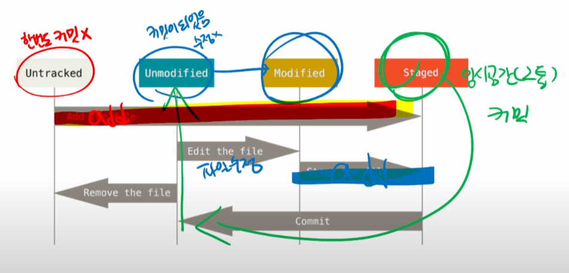

# 7/6 깃허브 활용

GIT (분산버전관리시스템)의 버전 생성 과정

커밋은 의미있는 저장이고 커밋된 스프트웨어는 반드시 작동가능한 상태여야 한다.

빈 폴더는 git status 해도 나타나지 않는다.

ctrl + C 는 탈출 명령어

**깃 허브**

원격저장소를 만들고, 로컬저장소의 커밋을 '**push**' 한다.

원격저장소 정보 확인 : git remote -v

원격저장소 지정 : git remote add origin **url**

원격저장소로 전송 : git push origin master