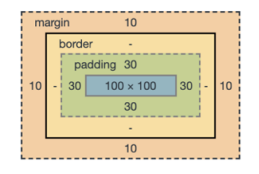

# WEB

### 웹사이트의 구성요소

**HTML : 구조**

**CSS : 표현**

**Javascript : 동작**

**웹사이트와 브라우저**

- 웹 사이트는 브라우저를 통해 동작함
- 브라우저마다 동작이 약간씩 달라서 문제가 생기는 경우가 많음(파편화)
- 해결책으로 웹 표준이 등장

**웹 표준**

- 웹에서 표준적으로 사용되는 기술이나 규칙
- 어떤 브라우저든 웹 페이지가 동일하게 보이도록 함(크로스 브라우징)

### HTML (Hyper Text Markup Language)

**Hyper Text란?**

- 참조(하이퍼링크)를 통해 사용자가 한 문서에서 다른 문서로 즉시 접근할 수 있는 텍스트

#### 기본 구조

- 모든 구성요소는 여는 태그(\
) 와 닫는 태그(\
) `p는 예시` 그리고 그 사이에 담기는 컨텐츠로 구성되어 있음

- 상위 구성요소를 구성하는 하위 구성요소를 둘 수 있음(요소 중첩)

- VScode 에서 html 파일을 생성하고 ! tab을 순서대로 누르면 자동으로 기본구조가 완성된다.

- **\<html>\</html>** : 문서의 최상위(root)  요소, 페이지 전체의 컨텐츠를 감싼다.

  - **\<head>\</head>** : 문서 메타데이터(데이터를 위한 데이터) 요소

    - 문서 제목, 인코딩, 스타일, 외부 파일 로딩 등

    - **일반적으로 브라우저에 나타나지 않는 내용**

    - **\<title>*브라우저제목*\</title>** 

      - 브라우저 상단 타이틀

    - **\<meta charset="utf-8">** 

      - 문서 레벨 메타데이터 요소
      - 닫는 태그 X(빈요소)

    - **\<link href="*style.css*" rel="*stylesheet*">**

      - 외부 리소스 연결 요소
      - 닫는 태그 X(빈요소)

    - **\**

      - 스크립트 요소(JavaScript 파일/코드)

    - **\**

      - CSS 직접 작성

      - ~~~html
        
        ~~~

      

  - **\<body>\</body>** : 문서 본문 요소

    - 실제 화면 구성과 관련된 내용
    - **\**  
      - 파일경로에 있는 이미지를 삽입
      - 닫는 태그 X(빈요소)
      - **대체텍스트는 파일경로에 있는 이미지가 잘못되었을 경우 출력되는 텍스트이지만, 시각장애인이나, 기타 다른 장애를 가지고 있는 사람들이 웹페이지를 확인할 때 출력되는 음성서비스가 대체텍스트를 기반으로 하기 때문에 반드시 표현하려고 했던 이미지에 대한 설명으로 작성하여야 한다.**

  

#### 텍스트 요소

- 인라인 요소와 블록 요소로 나뉨
- 인라인 요소는 글자처럼 취급
- 블록 요소는 한 줄 모두 사용

- **제목요소**
  - 마크다운 문서와 같이, 1에서 6수준까지 있으며, 1이 가장 큰 제목이다.
  - 표현은 **\<h1>*제목\</h1>***
  - 단순히 글자크기를 목적으로 사용하면 안되고 제목수준을 목적으로 사용해야 한다.
- **문단**
  - **\
*문자\
*** 로 표현
  - 일반적인 문자 내용을 나타낼 때 많이 사용한다.
  - **\ ** : 줄바꿈
  - **\
 **: 수평선
  - **\<b>*문자*\</b>** : 굵은 글씨 요소
  - **\<strong>*문자*\</strong>** : 굵은 글씨로 표현되고, 강조하고자 하는 요소로 지정됨.
  - **\<i>*문자*\</i>** : 기울임 글씨 요소
  - **\<em>*문자*\</em>** : 기울인 글씨로 표현되고, 강조하고자 하는 요소로 지정됨.
  - **\<pre>*문자*\</pre>** : HTML에 작성한 내용을 그대로 표현. 고정폭 글꼴이 사용되고 줄바꿈, 띄어쓰기 모두 적용됨.
  - **\<blockquote>*문자*\</blockquote>** : 텍스트가 긴 인용문, 들여쓰기를 한 것으로 표현됨
  - **\&lt;** 는 ''<''   **\&gt;** 는 ''>''
- **목록**
  - 순서가 없는 목록 \<ul>  (unordered list)
  - 순서가 있는 목록 \<ol>  (ordered list)

~~~html
<ul>
    <li>목록1</li>
    <li>목록2</li>
    <li>목록3</li>
</ul>
~~~

- **연결**
  - **\<a href="*https://링크*">*문자*\</a>**
  - [문자](https://링크) <--이런식으로 생성된다.

### CSS (Cascading Style Sheet)

- 스타일을 지정하기 위한 언어. 선택하고, 스타일을 지정한다.

- 위에서 아래로 흐르면서 스타일을 입혀준다.

- **id(#), class(.), 태그 순으로 스타일의 우선순위가 정해진다.**

- 같은 레벨이라면 나중에 '선언'된 것이 적용된다.

- 다만, 일반적으로 CSS 스타일링은 클래스로만 진행한다.

  - id 선택자는 일반적으로 하나의 문서에 1번만 사용하는 것이 관례이다.

  - id는 잘 활용하지 않고, 자바스크립트로 개발할 때 보통 활용한다.
  - 클래스 선택자는 마침표(.)문자로 시작하며, 해당 클래스가 적용된 항목을 선택

### css 기본 스타일

- px(픽셀)
  - 모니터 해상도의 한 화소인 '픽셀'기준
  - 픽셀의 크기는 변하지 않기 때문에 고정적인 단위
- %
  - 백분율 단위
  - 가변적인 레이아웃에서 자주 사용
- em
  - (바로 위, 부모 요소에 대한) 상속의 영향을  받음
  - 배수 단위, 요소에 지정된 사이즈에 상대적인 사이즈를 가짐
- rem
  - (바로 위, 부모 요소에 대한) 상속의 영향을 받지 않음
  - 최상위 요소(html)의 사이즈를 기준으로 배수 단위를 가짐
- 크기 단위(viewport)
  - 웹 페이지를 방문한 유저에게 바로 보이게 되는 웹 컨텐츠의 영역(디바이스 화면)
  - 디바이스의 viewport를 기준으로 상대적인 사이즈가 결정됨
  - ex) vw, vh, vmin, vmax

- 색상 키워드(background-color: red;)
  - 대소문자를 구분하지 않음
  - red, blue, black 과 같은 특정 색을 직접 글자로 나타냄
- RGB 색상(background-color: rgb(0, 255, 0);)
  - 16진수 표기법 혹은 함수형 표기법을 사용해서 특정 색을 표현하는 방식
  - RGBA의 마지막 A는 투명도를 의미한다.
- HSL 색상(background-color: hsl(0, 100%, 50%);)
  - 색상, 채도, 명도를 통해 특정 색을 표현하는 방식

### CSS Selectors

#### 선택자 정리

- 요소 선택자
  - HTML 태그를 직접 선택
- 클래스(class) 선택자
  - 마침표(.)문자로 시작하며, 해당 클래스가 적용된 항목을 선택
- 아이디(id) 선택자
  - \# 문자로 시작하며, 해당 아이디가 적용된 항목을 선택
  - 일반적으로 하나의 문서에 1번만 사용
  - 여러 번 사용해도 동작하지만, 단일 id를 사용하는 것을 권장

#### CSS 상속

- CSS는 상속을 통해 부모 요소의 속성을 자식에게 상속한다.
  - 속성(property) 중에는 상속이 되는 것과 되지 않는 것들이 있다.
  - 상속 되는 것 예시
    - Text 관련 요소(font, color, text-align), opacity, visibility 등
  - 상속 되지 않는 것 예시
    - Box model 관련 요소(width, height, margin, padding, border, box-sizing, display), position 관련 요소(position, top/right/bottom/left, z-index) 등

### `css 원칙 1`

**모든 요소는 네모(박스모델)이고, 위에서부터 아래로, 왼쪽에서 오른쪽으로 쌓인다.(좌측 상단에 배치)**

#### Box model

- 모든 HTML 요소는 box 형태로 되어있음

- 하나의 박스는 네 부분(영역)으로 이루어짐
  - **margin**: 테두리 바깥의 외부 여백, 배경색을 지정할 수 없음

  ~~~html
  .margin-1{
  	margin: 10px; <!--상하좌우 전부 10픽셀-->
  }
  
  .margin-2{
  	margin: 10px 20px; <!--상하 10픽셀, 좌우 20픽셀-->
  }
  
  .margin-3{
  	margin: 10px 20px 30px; <!--상 10픽셀, 좌우 20픽셀, 하 30픽셀-->
  }
  
  .margin-4{
  	margin: 10px 20px 30px 40px; <!-- 상 10픽셀, 우 20픽셀, 하 30픽셀, 좌 40픽셀, (시계방향으로 적용)-->
  }
  ~~~

  

  - **border**: 테두리 영역

  ~~~html
  .border{
  	border-width: 2px;
  	border-style: dashed;
  	border-color: black;
  } <!-- margin 과 마찬가지로 상하좌우로 나눠서 적용할 수 있다.-->
  
  .border{
  	border: 2px dashed black; <!-- 간단하게 표현도 가능하다.-->
  }
  ~~~

  

  - padding: 테두리 안쪽의 내부 여백 요소에 적용된 배경색, 이미지는 padding까지 적용 
  - content: 글이나 이미지 등 요소의 실제 내용

#### box-sizing

- 기본적으로 모든 요소의 box-sizing은 content-box

  Padding을 제외한 순수 contecnts 영역만을 box로 지정

- 다만, 우리가 일반적으로 영역을 볼 때는 border까지의 너비를 보는 것을 원함

  그럴 경우 box-sizing을 border-box로 설정

  ~~~html
  
  
  <!--활용예시-->
  <body>
      

          content-box
      

  </body>
  ~~~

  

### `CSS 원칙 2`

- **모든 요소는 네보(박스모델)이고, 좌측상단에 배치.**
- **display에 따라 크기와 배치가 달라진다.**

### CSS Display

- **display: block**
  - 줄 바꿈이 일어나는 요소
  - 화면 크기 전체의 가로 폭을 차지한다.
  - 블록 레벨 요소 안에 인라인 레벨 요소가 들어갈 수 있음.
  - 대표적인 블록 레벨 요소 **div**,  **ul**,  **ol**,  **li** ,  **p** ,  **hr** ,  **form**

- **display: inline**
  - 줄 바꿈이 일어나지 않는 행의 일부 요소
  - content 너비만큼 가로 폭을 차지한다.
  - width, height, margin-top, margin-bottom을 지정할 수 없다.
  - 상하 여백은 line-height로 지정한다.
  - 대표적인 인라인 레벨 요소 **span,  a,  img,  input,  label,  b,  em,  i,  strong**

- **display: inline-block**
  - block 과 inline 레벨 요소의 특징을 모두 가짐
  - inline처럼 한 줄에 표시할 수 있고, block처럼 width, height, margin 속성을 모두 지정할 수 있음

- **display: none**
  - 해당 요소를 화면에 표시하지 않고, 공간조차 부여되지 않음
  - 이와 비슷한 visibility: hidden은 해당 요소가 공간은 차지하나 화면에 표시만 하지 않는다.

~~~html
<!--좌측 정렬-->
.box{
	margin-right: auto;
	text-align: left;
}

<!--중앙 정렬-->
.box{
	margin-left: auto;
	text-align: right;
}

<!--수평 정렬-->
.box{
	margin-right: auto;
	margin-left: auto;
	text-align: center;
}
~~~

### `CSS 원칙 3 : Position으로 위치의 기준을 변경`

### CSS Position

문서상에서 요소의 위치를 지정

static: 모든 태그의 기본 값(기준 위치)

- 일반적인 요소의 배치 순서에 따름(좌측 상단)
- 부모 요소 내에서 배치될 때는 부모 요소의 위치를 기준으로 배치 됨

아래는 좌표 프로퍼티(top, bottom, left, right)를 사용하여 이동 가능

1. **relative** 상대 위치
   
   - 자기 자신의 static 위치를 기준으로 이동(normal flow 유지)
   - 레이아웃에서 요소가 차지하는 공간은 static일 때와 같음(normal position 대비 offset)
   
2. **absolute** 절대 위치

   - 요소를 일반적인 문서 흐름에서 제거 후 레이아웃에 공간을 차지하지 않음(normal flow에서 벗어남)
   - static이 아닌 가장 가까이 있는 부모/조상 요소를 기준으로 이동(없는 경우 브라우저 화면 기준으로 이동)
   - 

3. **fixed** 고정 위치

   - 요소를 일반적인 문서 흐름에서 제거 후 레이아웃에 공간을 차지하지 않음(normal flow에서 벗어남)
   - 부모 요소와 관계없이 viewport를 기준으로 이동 (스크롤 시에도 항상 같은 곳에 위치함)

4. **sticky** 스크롤에 따라 static -> fixed로 변경

   - 속성을 적용한 박스는 평소에 문서 안에서 position: static 상태와 같이 일반적인 흐름에 따르지만 

     스크롤 위치가 임계점에 이르면 position: fixed와 같이 박스를 화면에 고정할 수 있는 속성

   - 일반적으로 Navigaion Bar에서 사용됨

### CSS Flexible Box layout

- 행과 열 형태로 아이템들을 배치하는 1차원 레이아웃 모델
- main axis (메인(가로) 축) 과 cross axis (교차(세로) 축)
- **Flex Container(부모 요소)**
  - flexbox 레이아웃을 형성하는 가장 기본적인 모델
  - Flex Item 들이 놓여있는 영역
  - **display 속성을 flex 혹은 inline-flex로 지정**
- **Flex Item(자식 요소)** 
  - 컨테이너에 속해 있는 컨텐츠(박스가 될 수도 있음)

### 다양한 Flex 속성✔

- #### 배치 설정

  - ##### flex-direction :    `Main axis의 방향을 설정`

    - **row** : 좌에서 우
    - **row-reverse** : 우에서 좌
    - **column** : 위에서 아래
    - **column-reverse** : 아래에서 위

    

  - ##### flex-wrap

    - 아이템이 컨테이너를 벗어나는 경우 해당 영역 내에 배치되도록 설정하여 기본적으로 컨테이너 영역을 벗어나지 않도록 함
    - **wrap** : 좌에서 우로 , 자리가 없으면 줄바꿈.
    - **nowrap(기본값) **: 좌에서 우로, 자리가 없으면 컨텐츠 크기 조절. 기본적으로 박스 내 공간을 모두 차지할 수 있게 컨텐츠 크기 조절.
    - **wrap-reverse** : wrap 적용 후 시작부분과 끝부분을 뒤집음.

    

  - ##### flex-flow

    - flex-direction 과 flex-wrap 의 shorthand (파이썬의 리스트 컴프리핸션과 같이 두 속성을 합쳐서 표현할 수 있음)
    - EX)   flex-flow : row nowrap;
    
    

- #### 공간 나누기

  - ##### justify-content (main axis) : Main axis를 기준으로 공간 배분 **(flex-direction의 영향을 받음)**

    - **flex-start** : 앞으로 정렬
    - **flex-end** : 끝으로 정렬
    - **center** : 중앙 정렬
    - **space-between** : 아이템 사이의 간격을 균일하게 분배
    - **space-around** : 아이템을 둘러싼 영역을 균일하게 분배
    - **space-evenly** : 전체 영역에서 아이템 간 간격을 균일하게 분배

    

  - ##### align-content (cross axis) : Cross axis를 기준으로 공간 배분 (아이템이 한 줄로 배치되는 경우 확인할 수 없음)

    - **justify-content** 와 같은 사용법
    
    

- #### 정렬

  - ##### align-items (모든 아이템을 cross axis 기준으로)
    - **stretch(기본값)** : 컨테이너를 가득 채움
    - **flex-start** : 위로 밀기
    - **flex-end** : 아래로 밀기
    - **center** : 가운데 정렬
    - **baseline** : 텍스트의 baseline에 기준선을 맞춤
    
    
    
  - ##### align-self (개별 아이템을 cross axis 기준으로)
    - align-items와 같은 방식으로 사용
    - 컨테이너에 적용하는 것이 아니라 개별 아이템에 적용
    
    

- #### 기타 속성

  - ##### flex-grow

    - 남은 영역을 아이템에 분배

    

  - ##### order

    - 배치 순서를 정수형태로 지정함.

    - 기본값은 0, 제일 작은 수를 가지고 있는 아이템부터 출력. 

    - EX) 배치 순서를 지정하지 않은 3개의 아이템과 배치 순서를 -1로 지정한 아이템 `order: -1;` 이 있다면, 기본값이 0인 3개의 아이템들 보다 -1이 더 작기 때문에 -1로 지정한 아이템이 먼저 출력된다. 
  
      만약 배치 순서가 같다면 먼저 작성된 순서대로 출력된다.

background-image 로 영역 내 배경화면을 지정하기 위해서는 반드시 영역의 너비와 높이가 지정되어야 한다.

이 때 너비와 높이는 상속 받아도 상관없다.

또한 background-image는 일반 이미지 삽입시 입력하는 경로와 달리 상위 경로까지 추가하여야 한다. 상위경로는 ../ 이다.

